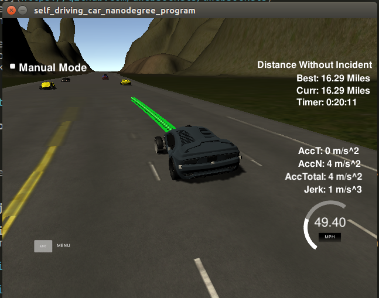

# CarND-Path-Planning-Project
Self-Driving Car Engineer Nanodegree Program
 


### Simulator.
You can download the Term3 Simulator which contains the Path Planning Project from the releases tab (https://github.com/udacity/self-driving-car-sim/releases).

### Overview
My main goal of this project was to have the vehicle navigate around the virtual highway as fast as possible. I definately put an emphasis on speed with safety/comfort second. The vehicle does not have any collisions and does not violate any of the jerk/accel limits, but it also doesn't make any friends while driving. This was done by focusing on using steering to avoid other vehicles before having to brake. A preview distance was used to see which adjacent lane had the furthest distance to the next vehicle and then this lane was selected to maneuver around the slower traffic.


### Goals
In this project your goal is to safely navigate around a virtual highway with other traffic that is driving +-10 MPH of the 50 MPH speed limit. You will be provided the car's localization and sensor fusion data, there is also a sparse map list of waypoints around the highway. The car should try to go as close as possible to the 50 MPH speed limit, which means passing slower traffic when possible, note that other cars will try to change lanes too. The car should avoid hitting other cars at all cost as well as driving inside of the marked road lanes at all times, unless going from one lane to another. The car should be able to make one complete loop around the 6946m highway. Since the car is trying to go 50 MPH, it should take a little over 5 minutes to complete 1 loop. Also the car should not experience total acceleration over 10 m/s^2 and jerk that is greater than 10 m/s^3.

#### The map of the highway is in data/highway_map.txt
Each waypoint in the list contains  [x,y,s,dx,dy] values. x and y are the waypoint's map coordinate position, the s value is the distance along the road to get to that waypoint in meters, the dx and dy values define the unit normal vector pointing outward of the highway loop.

The highway's waypoints loop around so the frenet s value, distance along the road, goes from 0 to 6945.554.

## Basic Build Instructions

1. Clone this repo.
2. Make a build directory: `mkdir build && cd build`
3. Compile: `cmake .. && make`
4. Run it: `./path_planning`.

Here is the data provided from the Simulator to the C++ Program

#### Main car's localization Data (No Noise)

["x"] The car's x position in map coordinates

["y"] The car's y position in map coordinates

["s"] The car's s position in frenet coordinates

["d"] The car's d position in frenet coordinates

["yaw"] The car's yaw angle in the map

["speed"] The car's speed in MPH

#### Previous path data given to the Planner

//Note: Return the previous list but with processed points removed, can be a nice tool to show how far along
the path has processed since last time. 

["previous_path_x"] The previous list of x points previously given to the simulator

["previous_path_y"] The previous list of y points previously given to the simulator

#### Previous path's end s and d values 

["end_path_s"] The previous list's last point's frenet s value

["end_path_d"] The previous list's last point's frenet d value

#### Sensor Fusion Data, a list of all other car's attributes on the same side of the road. (No Noise)

["sensor_fusion"] A 2d vector of cars and then that car's [car's unique ID, car's x position in map coordinates, car's y position in map coordinates, car's x velocity in m/s, car's y velocity in m/s, car's s position in frenet coordinates, car's d position in frenet coordinates. 

## Details

1. The car uses a perfect controller and will visit every (x,y) point it recieves in the list every .02 seconds. The units for the (x,y) points are in meters and the spacing of the points determines the speed of the car. The vector going from a point to the next point in the list dictates the angle of the car. Acceleration both in the tangential and normal directions is measured along with the jerk, the rate of change of total Acceleration. The (x,y) point paths that the planner recieves should not have a total acceleration that goes over 10 m/s^2, also the jerk should not go over 50 m/s^3. (NOTE: As this is BETA, these requirements might change. Also currently jerk is over a .02 second interval, it would probably be better to average total acceleration over 1 second and measure jerk from that.

2. There will be some latency between the simulator running and the path planner returning a path, with optimized code usually its not very long maybe just 1-3 time steps. During this delay the simulator will continue using points that it was last given, because of this its a good idea to store the last points you have used so you can have a smooth transition. previous_path_x, and previous_path_y can be helpful for this transition since they show the last points given to the simulator controller with the processed points already removed. You would either return a path that extends this previous path or make sure to create a new path that has a smooth transition with this last path.

## Tips

A really helpful resource for doing this project and creating smooth trajectories was using http://kluge.in-chemnitz.de/opensource/spline/, the spline function is in a single hearder file is really easy to use.

---

## Dependencies

* cmake >= 3.5
 * All OSes: [click here for installation instructions](https://cmake.org/install/)
* make >= 4.1
  * Linux: make is installed by default on most Linux distros
  * Mac: [install Xcode command line tools to get make](https://developer.apple.com/xcode/features/)
  * Windows: [Click here for installation instructions](http://gnuwin32.sourceforge.net/packages/make.htm)
* gcc/g++ >= 5.4
  * Linux: gcc / g++ is installed by default on most Linux distros
  * Mac: same deal as make - [install Xcode command line tools]((https://developer.apple.com/xcode/features/)
  * Windows: recommend using [MinGW](http://www.mingw.org/)
* [uWebSockets](https://github.com/uWebSockets/uWebSockets)
  * Run either `install-mac.sh` or `install-ubuntu.sh`.
  * If you install from source, checkout to commit `e94b6e1`, i.e.
    ```
    git clone https://github.com/uWebSockets/uWebSockets 
    cd uWebSockets
    git checkout e94b6e1
    ```

# [Rubic](https://review.udacity.com/#!/rubrics/1020/view) points

## Compilation

### The code compiles correctly.

No changes were made in the cmake configuration. The spline.h header file was added and used as suggested from the classroom.

## Valid trajectories

### The car is able to drive at least 4.32 miles without incident..
I ran the simulator multiple times up to 15 miles without violating any of the constraints or criteria.


### The car drives according to the speed limit.
The speed limit was set to 49.5 mph and by using a max_acc/decel of 0.3 that speed limit was never exceeded.

### Max Acceleration and Jerk are not Exceeded.
No accel or jerk error messages.

### Car does not have collisions.
The only collisions that occured were when another vehicle would cut off the subject vehicle. It looked like the car would begin to brake and/or steer but didn't have the braking authority or time to brake or steer out of the way.

### The car stays in its lane, except for the time between changing lanes.
The car stays in its lane except for the time between changing lanes. HOWEVER, the way it changes lanes is a little odd. It seems to get stuck for one cycle when it is on the lane lines. This could be do to the way I programmed the lane changes by comparing the distance of the closest traffic vehicle in each lane and chosing the largest distance for the desired lane. This means when it switches lanes it has to recalculate those distance and re-decide its desired lane before it is completely done with the lane change.

### The car is able to change lanes
The car is able to change lanes with the caveat mentioned above. One upside of the vehicle re-calcualting its desired lane for an upcoming lane change when it first enters the lane is that it can do what appears to be a double lane change in order to get around slower vehicles.

## Reflection
The first step I took was to implement the code from the project walkthough and Q&A. Once I had my car staying in my lane and slowing down for vehicles, the next step was to implement the lane change. To do this the lane change task was broken down into three parts: Prediction, Behaviors, and Trajectory generation.

### Prediction
Basically find out where all the traffic cars are and predict where they will be. Are there a good distance ahead of me so I need to steer around them? Is there a car on my left/right that won't allow me to change lanes? Is there a car immediately in front of me that I need to brake for?

This was easily done with the Frenet cordinates. The distance to start a lane change was if there was a vehicle 30m ahead. The safe zones to the L/R were no cars 7m behind the subject car and no cars 20m ahead of it. The distance to start braking was if there is a traffic vehicle 20m ahead of the subject vehicle.


### Behaviors 
This part decides what we should do. First we should try to steer to avoid a vehicle in our lane. When deciding what lane to change into select the one with the furthest distance to the next vehicle. Before changing lanes make sure that it is safe to do so. Finally if there is a car in front of us brake for it if we can't change lanes.

### Trajectory
Trajectories are generated based on the desired speed and lane from the output of the behavior module.

First, the last two points of the previous trajectory (or the car position if there are no previous trajectory) are used in conjunction three points at a far distance (30, 60, 90 m ahead) to initialize the spline calculation. The coordinates are transformed (shift and rotation) to local car coordinates for ease of calculation.The past trajectory points are copied to each new trajectory for additional continuity and the rest of the points are calculated by evaluating the spline and transforming the output coordinates to global coordinates.

### References
The course material was used as a reference along with the following previous students Github repos:
[Darien](https://github.com/darienmt/CarND-Path-Planning-Project-P1)
[Jeremy Shannon](https://github.com/jeremy-shannon/CarND-Path-Planning-Project)
